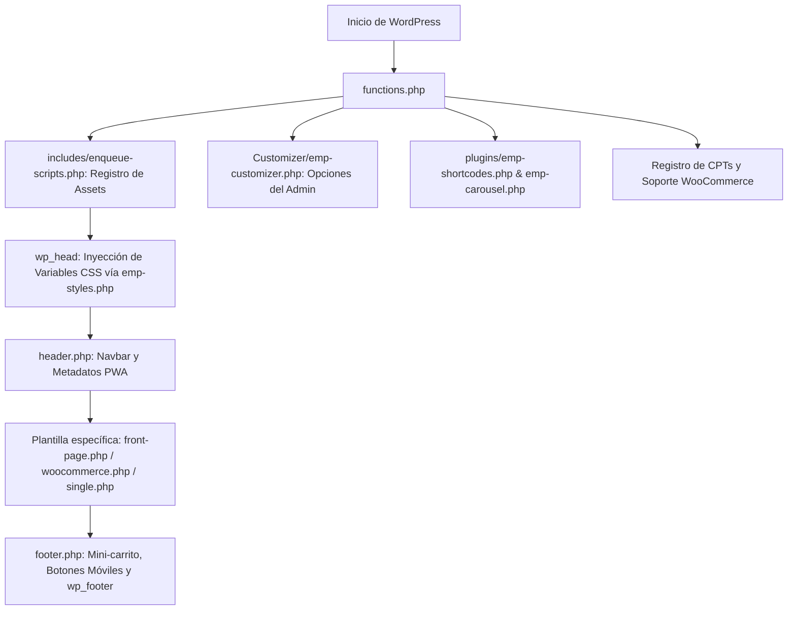

# Arquitectura y Estructura del Tema

Este documento describe la organización interna, el flujo de carga y los estándares de plantilla aplicados en **Empralidad**.

---

## 1. Organización de Directorios

```text
Empralidad/
├── Customizer/               # Módulos del Personalizador de WordPress
│   ├── analytics/            # Inserción de píxeles y scripts de seguimiento
│   ├── components/           # Botones, colores, cabecera, navegación y pie
│   ├── frontpage/            # Sliders, textos y elementos de la portada
│   ├── woocommerce/          # Opciones de productos, categorías y WhatsApp
│   ├── emp-customizer.php    # Registro del Customizer en WP_Customize_Manager
│   └── emp-styles.php        # Generación de variables CSS dinámicas (:root)
├── docs/                     # Documentación técnica del proyecto
├── img/                      # Recursos gráficos y logotipos por defecto
├── includes/                 # Lógica complementaria y assets del tema
│   ├── css/                  # Estilos adicionales (Bootstrap)
│   ├── fonts/                # Tipografías y Font Awesome local
│   ├── icons/                # Iconos SVG de componentes de hardware (CPU, GPU, RAM...)
│   ├── js/                   # Scripts de interactividad (complements.js)
│   ├── PWA/                  # Manifiesto y configuraciones de Progressive Web App
│   ├── enqueue-scripts.php   # Registro y encolado de scripts y hojas de estilo
│   └── wc-featured-products.php # Módulo de productos destacados
├── plugins/                  # Funciones modulares empaquetadas en el tema
│   ├── emp-carousel.php      # Lógica de carrusel para la portada
│   └── emp-shortcodes.php    # Shortcodes personalizados
├── woocommerce/              # Sobrescritura de plantillas de WooCommerce
│   ├── single-product/       # Plantillas de producto individual y tabs
│   │   ├── add-to-cart/      # Botones y formularios de compra
│   │   └── tabs/             # Pestaña de descripción, hardware y benchmarks
│   ├── content-product.php   # Tarjeta de producto en el catálogo (grid)
│   └── content-single-product.php # Vista general del producto individual
├── footer.php                # Pie de página, botones móviles y mini-cart
├── front-page.php            # Plantilla de la página de inicio
├── functions.php             # Punto de entrada principal y hooks de WordPress
├── header.php                # Cabecera HTML, navbar y video de fondo
├── style.css                 # Hoja de estilos principal del tema
└── woocommerce.php           # Plantilla base del archivo/catálogo de la tienda
```

---

## 2. Flujo de Carga y Ciclo de Vida

El proceso de inicialización y renderizado del tema sigue estos pasos:



1. **Carga Inicial (`functions.php`):**
   - Registra soporte para WooCommerce (`add_theme_support('woocommerce')`).
   - Define el menú de navegación principal (`register_nav_menus`) con un *Walker* personalizado (`Walker_Nav_Primary`) para submenús desplegables.
   - Registra áreas de widgets (*sidebars*) para la portada y el pie de página.
   - Carga la lógica del Personalizador, scripts y shortcodes.

2. **Inyección Dinámica de Estilos (`Customizer/emp-styles.php`):**
   - Conectado al hook `wp_head` mediante `emp_theme_customize_css()`.
   - Lee los valores configurados en el personalizador (`get_theme_mod`) y los inyecta en variables CSS globales (`:root`), permitiendo cambios en tiempo real sin recompilar CSS.

3. **Encolado de Assets (`includes/enqueue-scripts.php`):**
   - Utiliza la función nativa `wp_enqueue_scripts`.
   - Aplica *cache-busting* utilizando la versión declarada en `style.css`.
   - Carga los scripts al final de la página (`$in_footer = true`) para no bloquear el renderizado inicial (*FCP*).

---

## 3. Jerarquía de Plantillas

- **`front-page.php`:** Portada principal. Controla los 3 sliders superiores, el carrusel de bienvenida y secciones dinámicas del personalizador.
- **`woocommerce.php`:** Plantilla base para el catálogo de la tienda. Incluye barra lateral con filtros, breadcrumbs y buscador integrado.
- **`single.php` / `page.php`:** Entradas de blog y páginas estándar de WordPress.
- **`single-contact.php` / `single-landing_pages.php`:** Plantillas para tipos de contenido personalizados (*CPT*).
